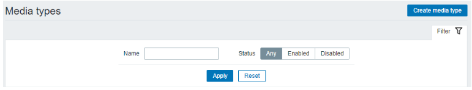
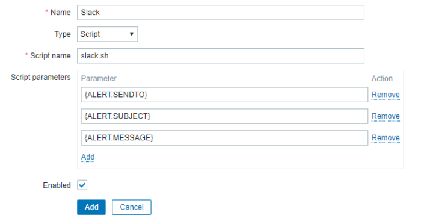
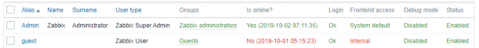
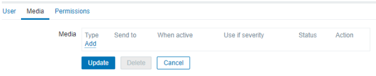
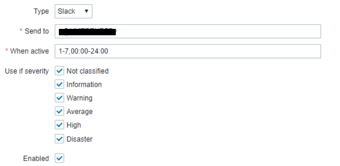
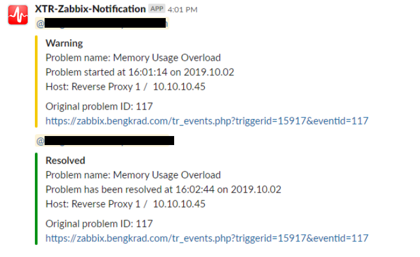

# Zabbix-Slack-Integration
Zabbix as a powerful light weight monitoring system can be integrated with a Slack Workspace.

### Slack App Preparation

1. Go to https://api.slack.com and click on Start Building button to build a new app.<br>

2. Create a Slack App popup will appear. Input app name, select the development workspace, and then click Create App.<br>

3. Select the Incoming Webhooks to add functionality of external source via post message which can be requested using a bash script.<br>

4. Click on Activate Incoming Webhooks.<br>

5. Scroll down and look for the Add New Webhook to Workspace button.<br>

6. Select on where will we post our message be. In this case, we will post it in #general.<br>

7. We will retrieve a sample curl POST request.<br>

8. To test, copy the command to a Linux terminal.<br>
```
$ curl -X POST -H 'Content-type: application/json' --data '{"text":"Hello, World!"}' <Input your Webhook here>
```


### Bash Script Preparation

Inside the Zabbix Server, put the slack.sh bash script inside Zabbix Alert directory. By default, it is located in /usr/lib/zabbix/alertscripts.

```
#!/bin/bash

if [ "$2" == "Information"  ]
then
  color=#2F66A9
elif [ "$2" == "Warning" ]
then
  color=#F4C900
elif [ "$2" == "Average" ]
then
  color=#EF820D
elif [ "$2" == "High" ]
then
  color=#CC5500
elif [ "$2" == "Disaster" ]
then
  color=#CC0202
elif [ "$2" == "Resolved" ]
then
  color=#008F11
else
  color=#A19C9C
fi

json='{"attachments": [{ "color":"%s","pretext":"%s","title":"%s","text":"%s"}]}'

payload=$(printf "$json" "$color" "$1" "$2" "$3")

curl -X POST -H 'Content-type: application/json' --data "$payload"  <Insert Webhook URL Here>
```

### Zabbix Frontend Preparation

1. Go to the Zabbix Dashboard, navigate to Administration → Media Types, and click on Create media type.<br>

2. Input media name, select type as script, input script name and script parameters.<br>

3. Navigate to Administration → Users, and click on one of the users that we want to modify its media. In this case, we will be using Admin.<br>

4. Go to Media tab, and add a media.<br>

5. Select type Slack and input the Slack ID we would like to mention<br>

6. Check on the Slack Notification<br>

