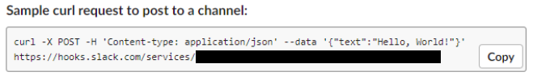

# Zabbix-Slack-Integration
Zabbix as a powerful light weight monitoring system can be integrated with a Slack Workspace.

## Slack App Preparation

1. Go to https://api.slack.com and click on Start Building button to build a new app.<br>

2. Create a Slack App popup will appear. Input app name, select the development workspace, and then click Create App.<br>

3. Select the Incoming Webhooks to add functionality of external source via post message which can be requested using a bash script.<br>

4. Click on Activate Incoming Webhooks.<br>

5. Scroll down and look for the Add New Webhook to Workspace button.<br>

6. Select on where will we post our message be. In this case, we will post it in #general.<br>

7. We will retrieve a sample curl POST request.<br>

8. To test, copy the command to a Linux terminal.<br>
```
$ curl -X POST -H 'Content-type: application/json' --data '{"text":"Hello, World!"}' <Input your Webhook here>
```

